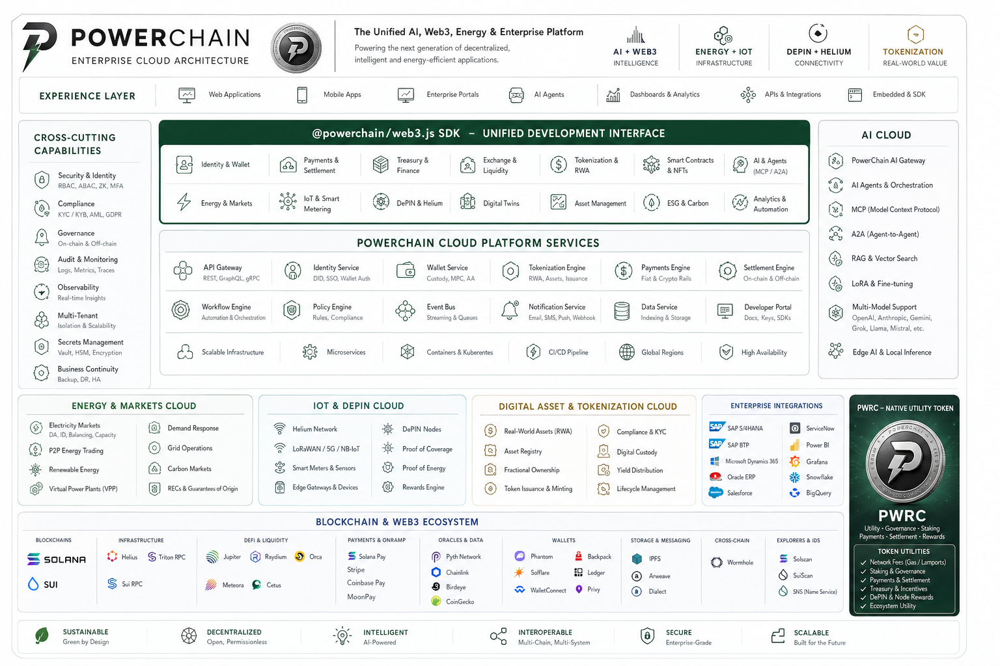

# Architecture

> Enterprise Architecture for **@powerchain/web3.js**
**Version:** `v1.0.0-beta`
PowerChain Web3.js is designed as a modular, enterprise-grade JavaScript and TypeScript SDK that provides a stable, extensible and strongly typed interface for interacting with the PowerChain Network.
The architecture follows modern cloud-native design principles with emphasis on:
- Modularity
- Performance
- Security
- Scalability
- Observability
- Developer experience
- Long-term maintainability
PowerChain Web3.js unifies blockchain infrastructure, programmable finance, renewable energy systems, AI services and enterprise application tooling through a single developer platform.
---
# Table of Contents
- Architecture Principles
- Design Goals
- High-Level Architecture
- Architecture Diagram
- Layered Architecture
- Package Architecture
- Runtime Architecture
- Client Lifecycle
- Module Overview
- Transport Layer
- Middleware Pipeline
- Plugin System
- Authentication & Identity
- Wallet Architecture
- Blockchain Services
- Payments Architecture
- Treasury Architecture
- Exchange Architecture
- Renewable Energy Platform
- AI Platform
- Event System
- Security Model
- Observability
- Performance
- Scalability
- Repository Architecture
- Deployment Model
- Compatibility
- Design Decisions
- Future Architecture
---
# Architecture Principles
PowerChain Web3.js is built around core engineering principles:
- Modular by design
- TypeScript-first APIs
- Stable public interfaces
- Separation of concerns
- Cloud-native architecture
- Backwards compatibility
- Security by default
- Performance-oriented implementation
- Plugin and middleware extensibility
- Comprehensive observability
---
# Design Goals
The architecture provides:
- Consistent developer experience
- Cross-platform compatibility
- Enterprise-grade reliability
- Low-latency communication
- Strong typing across public APIs
- Efficient bundle sizes
- Clear package boundaries
- High testability
- Predictable release lifecycle
- Long-term maintainability
---
# High-Level Architecture
```text
┌──────────────────────────────────────────────┐
│                Applications                  │
│ Next.js • React • Vue • Node.js • Mobile     │
│ Serverless • Edge Runtime                   │
└──────────────────────────────────────────────┘
                    │
                    ▼
┌──────────────────────────────────────────────┐
│            @powerchain/web3.js SDK           │
│                                              │
│ Client • Wallet • Payments • Treasury        │
│ Exchange • Energy • AI • Governance          │
└──────────────────────────────────────────────┘
                    │
                    ▼
┌──────────────────────────────────────────────┐
│              Runtime Layer                   │
│ Middleware • Plugins • Cache • Events        │
│ Telemetry • Logging                          │
└──────────────────────────────────────────────┘
                    │
                    ▼
┌──────────────────────────────────────────────┐
│             Transport Layer                  │
│ REST • JSON-RPC • GraphQL • WebSocket        │
└──────────────────────────────────────────────┘
                    │
                    ▼
┌──────────────────────────────────────────────┐
│       PowerChain Network Infrastructure      │
│ Solana • Helius • Jupiter • Pyth             │
└──────────────────────────────────────────────┘

⸻

Architecture Diagram

<p align="center">

</p>
<p align="center">
<sub>
PowerChain Web3.js enterprise architecture showing application,
SDK, runtime, transport and blockchain infrastructure layers.
</sub>
</p>

⸻

Layered Architecture

PowerChain Web3.js is organised into six logical layers:

Layer	Description
Application Layer	User applications, frameworks and integrations
SDK Layer	Public SDK clients and domain modules
Runtime Layer	Middleware, plugins, caching and events
Transport Layer	REST, JSON-RPC, GraphQL and WebSocket communication
Platform Layer	PowerChain services and blockchain infrastructure
Infrastructure Layer	Cloud, storage, monitoring and networking

⸻

Package Architecture

@powerchain/web3.js
├── Client
├── Wallet
├── Payments
├── Treasury
├── Exchange
├── Marketplace
├── Energy
├── AI
├── Governance
├── Analytics
├── Identity
└── Utilities

Each package:

* Maintains focused responsibilities
* Minimises dependencies
* Supports tree shaking
* Provides TypeScript definitions
* Follows semantic versioning

⸻

Runtime Architecture

The runtime manages SDK execution and service orchestration.

Components:

* Configuration Manager
* Request Pipeline
* Response Pipeline
* Retry Engine
* Cache Manager
* Event Bus
* Plugin Loader
* Logger
* Metrics Collector
* Telemetry Provider

⸻

Client Lifecycle

Create Client
      │
Load Configuration
      │
Initialise Runtime
      │
Authenticate
      │
Register Services
      │
Execute Requests
      │
Process Responses
      │
Emit Events
      │
Collect Metrics
      │
Shutdown

⸻

Module Overview

Module	Responsibility
Client	SDK entry point
Wallet	Accounts and signing
Payments	Payments and settlement
Treasury	Liquidity and financial operations
Exchange	Swap and routing services
Marketplace	Digital asset commerce
Energy	Renewable infrastructure
AI	Agents and automation
Governance	Voting and proposals
Analytics	Metrics and reporting
Identity	Authentication and organisations

⸻

Transport Layer

Supported protocols:

* REST
* JSON-RPC
* GraphQL
* WebSocket
* Streaming APIs

Transport features:

* Connection pooling
* Request batching
* Retry handling
* Timeout management
* Response validation

⸻

Middleware Pipeline

Request
↓
Authentication
↓
Validation
↓
Policy Engine
↓
Retry Logic
↓
Transport
↓
Response Validation
↓
Telemetry
↓
Application Result

Middleware can be extended without modifying SDK core functionality.

⸻

Plugin System

The plugin framework enables ecosystem extensions.

Plugins support:

* Custom authentication
* Additional services
* Middleware extensions
* Event handlers
* Enterprise connectors
* Analytics integrations

Example:

client.use(plugin);

⸻

Authentication & Identity

Supported authentication:

* API Keys
* OAuth 2.1
* OpenID Connect
* JWT
* WebAuthn Passkeys
* Service Accounts

Authorisation:

* RBAC
* ABAC
* Policy Engine
* Organisation Management

⸻

Wallet Architecture

Wallet capabilities:

* Account creation
* Key management
* Transaction signing
* Message signing
* Recovery workflows
* Multi-signature support

⸻

Blockchain Services

Capabilities:

* Wallet management
* Transaction construction
* Transaction simulation
* Transaction signing
* SPL Tokens
* Token-2022
* Program interaction
* RPC communication
* Cross-chain infrastructure

⸻

Payments Architecture

Services:

* Checkout
* Billing
* Invoicing
* Payroll
* Escrow
* Settlement
* Payment links
* Merchant services

⸻

Treasury Architecture

Capabilities:

* Treasury accounts
* Liquidity management
* Reserve management
* Forecasting
* Automation
* Financial reporting

⸻

Exchange Architecture

Capabilities:

* Token swaps
* Liquidity routing
* Bridge operations
* Price discovery
* Slippage protection
* Portfolio services

⸻

Renewable Energy Platform

PowerChain connects renewable infrastructure with blockchain technology.

Supported domains:

* Solar
* Wind
* Hydro
* Battery storage
* Hydrogen
* Renewable Energy Certificates
* Carbon credits
* Smart meters
* IoT devices
* GridOS™

⸻

AI Platform

AI capabilities:

* Financial Copilot
* Treasury Copilot
* Risk Engine
* Fraud Detection
* Forecasting
* Workflow Automation
* AI Agents

⸻

Event System

SDK events include:

* Client initialised
* Wallet created
* Transaction submitted
* Payment completed
* Quote updated
* Bridge completed
* Governance action created

⸻

Security Model

Security controls:

* TLS 1.3
* AES-256 encryption
* Secure secret management
* Signed transactions
* Policy enforcement
* Audit logging
* Code signing
* Package provenance
* Dependency scanning
* CodeQL analysis

⸻

Observability

Supported observability:

* OpenTelemetry
* Structured logging
* Metrics
* Distributed tracing
* Health checks
* Performance profiling

⸻

Performance

Metric	Target
Client initialisation	< 50 ms
Wallet creation	< 100 ms
Transaction build	< 20 ms
Bundle size	< 150 kB gzip
Memory footprint	< 20 MB

⸻

Scalability

Designed for:

* Horizontal scaling
* Multi-region deployments
* Stateless services
* Connection pooling
* Request batching
* Streaming APIs
* Edge execution

⸻

Repository Architecture

apps/
packages/
programs/
contracts/
registry/
schemas/
specifications/
runtime/
platform/
docs/
examples/
tests/
benchmarks/
tools/

⸻

Deployment Model

Supported environments:

* Local development
* CI/CD pipelines
* Docker containers
* Kubernetes
* Serverless platforms
* Edge runtimes
* Enterprise cloud deployments

⸻

Compatibility

Supported runtimes:

* Node.js 20+
* Modern browsers
* Bun
* Deno
* React Native
* Electron
* Cloudflare Workers
* Vercel Edge Runtime

⸻

Design Decisions

Architecture Decision Records (ADRs) document:

* Public API evolution
* Transport decisions
* Runtime compatibility
* Dependency strategy
* Performance optimisation
* Security decisions

⸻

Future Architecture

Planned improvements:

* Local blockchain emulator
* Advanced plugin marketplace
* AI orchestration layer
* Multi-network support
* Distributed execution
* Additional language SDKs
* Enterprise integrations

⸻

Version

PowerChain Web3.js

Version: v1.0.0-beta

Enterprise AI-Native Renewable Energy & Financial Infrastructure.
